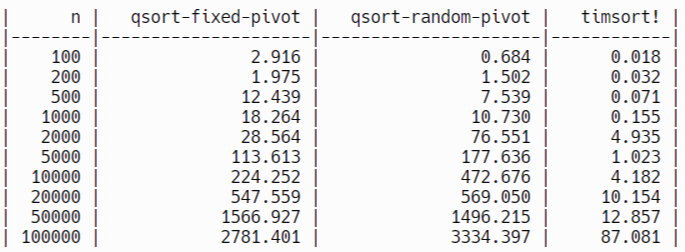

# CMPS 2200 Reciation 5
## Answers

**Name:**__Kayla Willis & Cameron Mclaren_______________________

Place all written answers from `recitation-05.md` here for easier grading.

- **1b.**

Fixed qsort implementation seems to perform better with the highest n values at n=50000 and n=100000. At this level, the difference between fixed and random is much larger. At the levels below this, the two performed much more similarly, with the fixed pivot not always performing better. 

- **1c.**
Timsort seems to perform faster than both implementations. It is clearly the most effective algorithm for this sorting task.